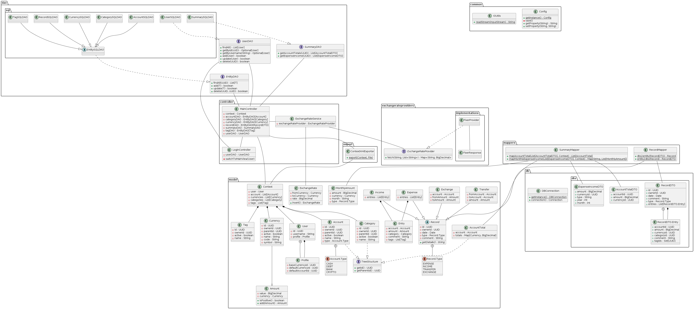

# MyExpenseTracker

## Description

It's the final project for the <i>Java Aufbaukurs</i>. The main goal is to practice common Java libraries and approaches, not a production level application.

## Plan

### Functionality and structure
- JavaFX desktop application.
- Maven project.
- Managing expenses, incomes, transfers and exchanges.
- Managing accounts, currencies, categories and tags.
- Storing data in the H2 embedded database.
- DB manipulations with JDBC using DAO pattern.
- Export user data to XML using Jackson.
- Fetching currency exchange rates from public APIs.
- Logging via SLF4J.
- Dashboard with diagrams and calculated tables.
- Class diagram.
- Tests.

### Deliberately not planned
- Authorization
- ORM
- JSR 354 / Currency and Money API
- Data queries with pagination and filters
- Complex validation

## What was done
- JavaFX app with multiple FXML and Controllers
- Logging via slf4j
- Unit tests
- JDBC DB operations with DAO pattern
- Lombok annotations
- Queries public REST API and parsing response with Jackson
- JavaFX Services
- Exporting to XML using Jackson
- Practiced Java features
  - Generics (classes, interfaces, methods)
  - Bounded type parameters
  - Records and Enums
  - Streams
  - Lambdas
  - Switch expressions
  - Switch with pattern matching
  - Nested classes
  - Sealed classes
  - Optional type

## Class diagram
